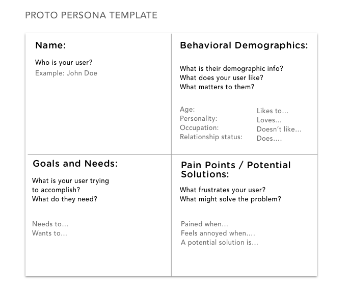
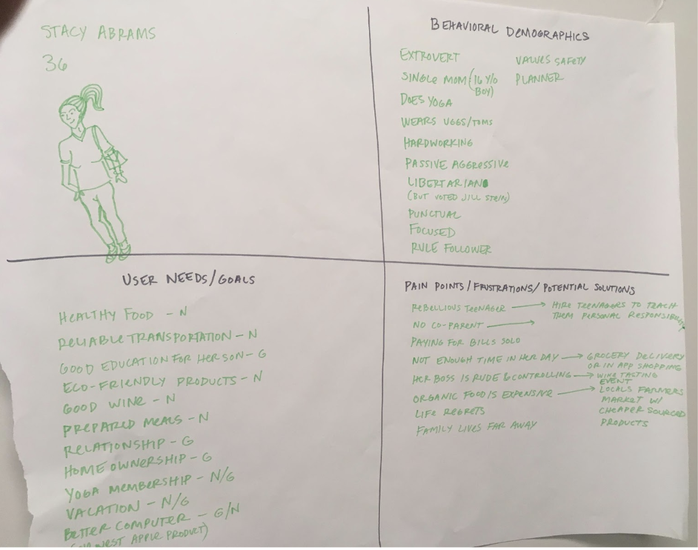

## Proto Personas
---

Let's practice creating proto personas by considering a typical user of Airbnb.

### Instructions

---

1. To begin, get into a group of two with a classmate.

2. Take out a sheet of paper and sketch the proto persona template.

    

- Divide your sheet of paper into four sections.

- Label the sections: 
    - User
    - Behavior Demographics
    - Needs/Goals
    - Pain Points / Frustrations / Potential solutions
    
2. Consider a typical user of airbnb.

    - Go to [Airbnb](http://airbnb.com).
    - Try to create a proto persona for a person who uses Airbnb.

3. Fill out each section.

    - Who is your user?
    - What is their demographic info?
    - What does your user like?
    - What matters to them?
    - What is the user trying to accomplish?
    - What frustrates the user?
    - What are some potential solutions for their frustrations?

4. Take a photo.

    

5. Share in slack!

---

Trilogy Education Services © 2019. All Rights Reserved.
