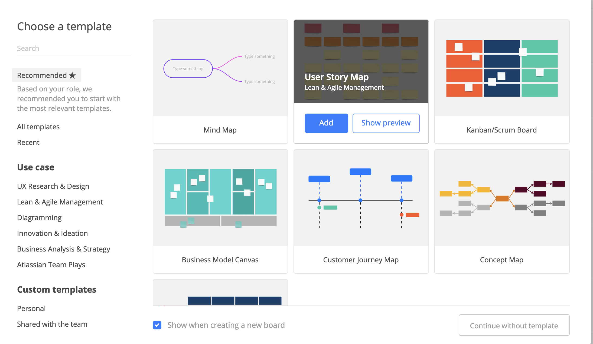

## Affinity Diagramming
---

Let's practice create an affinity diagram using our interview data from the last activity.

Affinity Diagrams are a brainstorming tool used by designers to organize ideas and data.

### Instructions

---

1. To begin, group up in a pair of two with your classmate with whom you wrote your user interview plan.

- You will be sharing data for this affinity diagram.

2. If you have pens, paper and sticky notes, skip to step 4.

 - If you don't have supplies continue to step 3.

3. Create an account on realtimeboard.com.

-  Use the [Realtimeboard Signup Link](https://realtimeboard.com/signup/).

- After creating an account, select a template.

    

  - We recommend you use the user story map template.

  - To edit a sticky note, select the sticky note and then double-click. 

4. Write your data, ideas and observations on individual post-it notes.

  - Use one color Post-it per group member to represent 1 user interview.

  - Review your interview notes and write down as many ideas, research facts, and thoughts on travel. 

  - One idea per post-it note.

5. Create categories:

- Individually look for similarities or overlapping ideas /  research facts / thoughts between Post-its.

- Group them and decide how to label that grouping.

- Trends you notice most frequently will be used to inform and iterate your user personas needs.

6. Compile categories as a group:

- As a group, combine your categories from part 2. 

7. Categorize and label your groups.

- Ideally, use a different color sticky note for your group labels.

---

Trilogy Education Services © 2019. All Rights Reserved.
