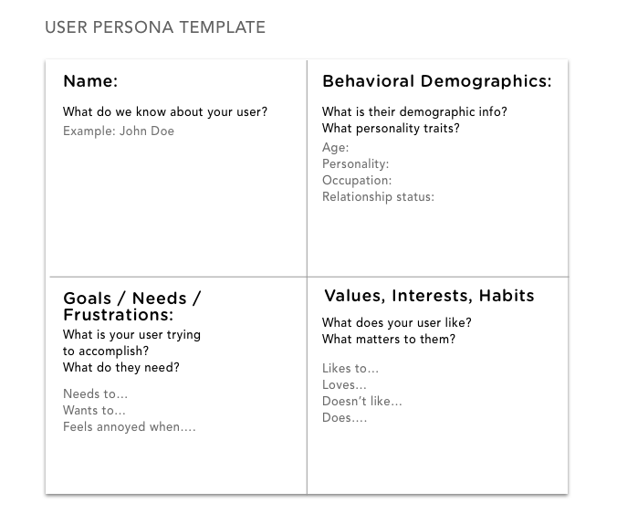
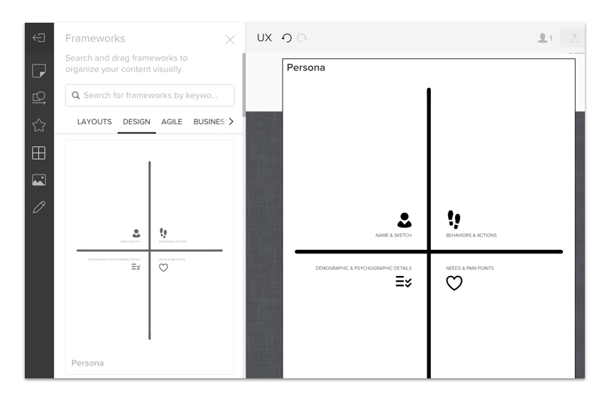

## User Personas
---

Let's iterate our proto persona from last class.

Designers create personas from user data as way to understand user goals and needs as well as ideate on potential solutions.

### Instructions

---

1. To begin, take out your supplies:

- Proto persona.
- Affinitiy diagram.

2. Take out a sheet of paper or continue using your realtimeboard from the last activity.

- If you are using paper, sketch the template.

    

- If you are using realtimeboard, click the fifth icon on the left side bar (called frameworks). 

    - Select the design tab.
    
    - Drag the persona template onto the canvas.

    

- You will be sharing data for this affinity diagram.

3. Describe the user:

A) Header
- What is a good fictional name?

B) Behavioral Demographics
- What is the age of your person?
- What is the gender of your person?
- What is the highest level of education this person has received?
- How much work experience does your person have?
- What is your person’s professional background?  
- What is their relationship status?
- What type of personality traits do they have?

C) Goals, Needs and Frustrations
- What are there user needs, interests, and goals?
- What is your person motivated by? 
- What are they looking for?
- What is your person looking to do? 
- What are her or his needs?
- What makes them annoyed?

D) Values and Interests
- What do the like or love?
- What do the not like?
- What matters to them?

E) Technical
- What technological devices does your person use on a regular basis?
- What software and/or applications does your person use on a regular basis?
- How much time does your person spend browsing the web every day?

4. Take a photo or a screenshot.

5. Post in slack!

---

Trilogy Education Services © 2019. All Rights Reserved.
