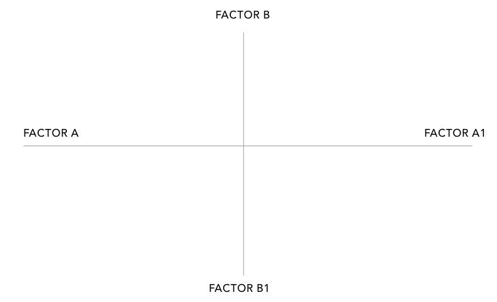
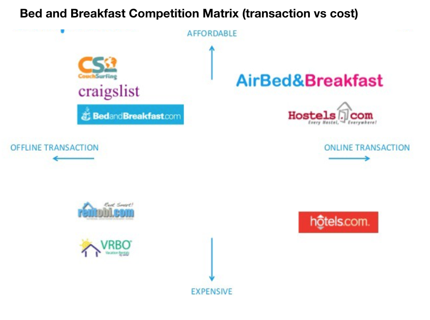

## Competitor Analysis
---

Now that we know who are user is, let's learn about the competition.

By researching the competition, designers can glean insights from the data collected and make more informed UX design decisions.

### Instructions

---

1. To begin, refer back to the user persona you created in the previous activity.

- Based off the needs and goals of your users spend 10 minutes researching apps that your user might user to solve their problems.

2. Look for commonalities around competitors. Some things to consider:

- The tone and copy of the competitor.
- Good and bad features.
- User reviews.
- Wait/load times.
- Customer service.
- UX & UI Design.

3. Take out a sheet of paper and sketch out the competitor analysis template.

- Define variables for your x-axis & y-axis.

4. Plot competition in the Matrix based on where they fall between the user needs and user frustrations.

    
    
---

Trilogy Education Services © 2019. All Rights Reserved.
