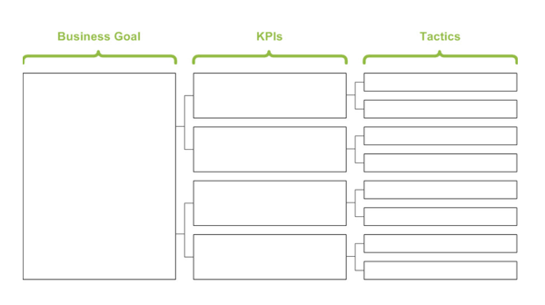
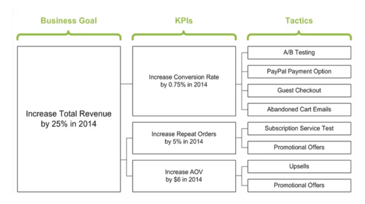

## KPIs
---

Let's practice defining a KPI for Airbnb.com.

Key Performance Indicators, also known as KPIs, are quantifiable measurements that help an organization define and track the progress toward its goals.

### Instructions

---

1. To begin, take out a sheet of paper and copy down the KPI template.

2. Go to [airbnb.com](www.airbnb.com).

3. Consider a goal for the website.

4. Define a KPI & specific tactics you would use to measure how you will accomplish your business goal.

- Review the example below:

---

Trilogy Education Services © 2019. All Rights Reserved.
