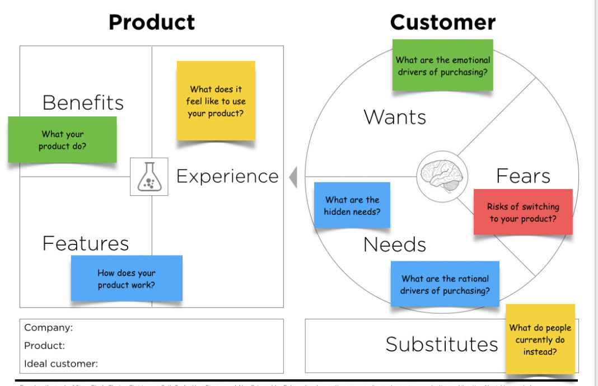
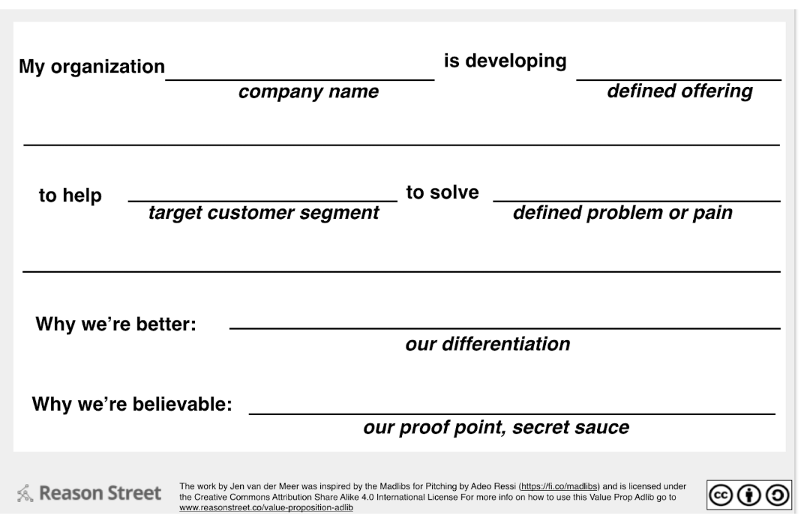

## Value Proposition Statement
---

Let's practice creating a value proposition statement. We'll use Airbnb as a test subject.

### Instructions

---

1. To begin, group up in a pair of two.

2. Get a large sheet of paper or space on a whiteboard.

3. Recreate the value proposition canvas.

    

- Divide your poster paper in half and draw a square on the left & a circle on the right.
- Label the Square: 'Product'.
- Label the Circle: 'User'.
- Divide the Square into 3 sections and label them: 'Benefits, Features & Experience'.
- Divide the Circle into 3 sections and label them: 'Needs, Wants & Goals'.

4. Go to [Airbnb](www.airbnb.com).

5. Set a timer for 20 minutes and begin filling out the value proposition canvas.

- For benefits, describe what Airbnb does.
- For features, answer how does Airbnb work?
- For experience, describe what it feels like to use Airbnb.
- For wants, describe what emotionaly drives a purchase.
- For fears, describe the risk of using Airbnb as opposed to another similar service.
- For needs, describe the rational drivers behind making a purchase.

6. Take out a sheet of paper.

- Using the value proposition statement madlib attempt to write your own.

    

---

Trilogy Education Services © 2019. All Rights Reserved.
