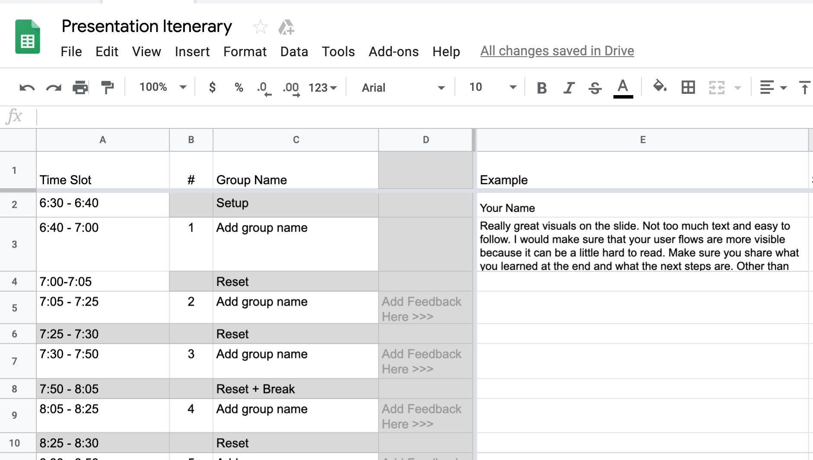

## 7.1 Lesson Plan: Project 1 How to Design a Case Study
---

### Overview

Today's class will introduce students to how to design a case study for their design portfolios! Students will spend the day preparing for their presentations.  

---

### Class Objectives

By the end of class today, students will:

- Write a case study outline for their project 1 presentation. 

- Build a mobile app case study in Google Slides.

---

### Instructor Notes

- Today, students will work on presentations, documenting their design process during project 1. The first part of the day, students will complete a case study outline. Students will spend the rest of the day building out their case study in Google Slides. 

- **Important** Make a copy of the presentation itinerary Google sheet and instruct students to sign up for a presentation time.
    - [Presentation itinerary template](https://drive.google.com/open?id=1uKNK9uleEljCdXxBII1ubmKn2zwKGrhlm2DVZ1IFNiM)

    - 

- **Remember** It is okay if students are still working on their projects. Encourage them to keep going but also let them know that now is the time to prepare for their presentations. Communicate to students that as designers, our work is never finished. It is very common to present "unfinished" work. 

- Keep track of the clock. Have TAs consult the TimeTracker: https://docs.google.com/spreadsheets/d/1l-z7daVsBTE-4xozjq9oKn7dPImUS-rMC9tgC_bx9HA/edit?usp=sharing

---

### Office Hours: Daily UI (45 mins before class) 

> Note: Encourage your students to make the most out of each class, and to not be afraid to ask questions.  

### 1. Instructor Do: Welcome & Week Overview (3 min) 

Welcome students to class and open the slides: [Project 1 Presentation Prep](https://docs.google.com/presentation/d/1_m7u7gHkfVHMHUowHw9nyCgdKYbkknT5KGMcp3Q_4wM/edit?usp=sharing).

This week students will complete their design sprint. Today students will work on building their case study. The next two days of this week are reserved for design presentations.

### 2. Instructor Do: Project 1 Presentation Requirements and Tips (10 mins)

#### Project 1 presentations:

- Each presentation will last 10 minutes.

- Each group will receive 5–10 minutes of constructive feedback.

#### Presentation requirements:

- Presentations should be in Google Slides. Prototypes should be built in InVision.
- A presentation should have 10–15 slides, last 10 minutes, and contain no font smaller than 12 points.

Make sure to:

- Set up the problem
- State the value proposition or problem statement
- Define the user persona (including goals, needs, potential gains/opportunities) 
- Cite user research
- Illustrate the user journey/storyboards
- Outline user testing 
- Describe iterations based on problems encountered
- Present final InVision prototype (mobile)

>Note: Each team member should present an equal share of the work.

#### Presenting Design Work:

Did you know 70% of employed Americans say that presentation skills are critical for career success?

- Have TAs slack out "70% say presentation skills are critical for career success" 
https://www.forbes.com/sites/carminegallo/2014/09/25/new-survey-70-percent-say-presentation-skills-critical-for-career-success/#4af2bbef8890

Why UX Design Presentations are important: We have to sell our ideas if we want to get the green light from clients. For designers, this means we need to get used to public speaking and presenting. Behind every presentation is a story. Once you know the story that you want to tell, the design of the presentation should support the message.

The benefits of presentation skills:

- Increase your self-confidence
- Effective way to communicate your ideas
- Let you demonstrate your knowledge

Why UX design presentations go wrong:

- It can be hard to figure out how to present your designs in the right light.
- The challenges of presenting a UX design vary from project to project.

Common issues include:

- Talking UX jargon to non-UXers
- Relying on wireframes to get your point across
- Not validating ideas before presenting them
- Making presentations too short or too long
- Performance anxiety 

How to improve your presentations: practice, practice, practice.

- Being under-prepared for a UX design presentation can not only turn off your audience but it can hinder your chances of getting work.
- A good way to see how well you’re doing is to record yourself giving the presentation.

Use eye contact strategically

- Eye contact must be respectful and confident. 
- Research has found that 3 seconds is a good amount of time to look at someone before things start to get weird.
- Have TAs slack out link to "How long to make eye contact"
https://www.businessinsider.com/heres-how-long-you-should-hold-eye-contact-2016-7

Use wireframes to focus on functionality, not aesthetics.

- Imagine this: You want a stakeholder to validate the functional requirements of an early-stage design, but they keep asking you about colors and icon design. Aaghh!
- Remember: keep wireframes grayscale!

Use mockups and animation to aid imagination

- It isn’t uncommon to have a client who knows literally nothing about design. 
- Without a shared design language, it can be difficult to express tricky concepts and user experience design rationale.
- Mockups and animation can help your client visualize and imagine how the final product is going to look.

Hold a Q&A session

- Q&A sessions can help to inspire, inform, and solidify any knowledge imparted during your talk.

Over deliver

- Don't be afraid to go the extra mile!

#### Presentation Strategies

##### Expose your design process:

- Don’t be afraid to put your raw sketches out there for the project team to see.
- When storytelling, one of the designer’s most powerful contributions is the design process. 
- When presenting to a group of people, common questions are “how did you come up with this?” or “why did you decide to do it this way?” 
- Exposing the design process brings your audience on the journey of how your thoughts developed.
- It’s a good idea to include at least one slide that provides some context on how you arrived at your design. That can include any deliverables that might help support your narrative and design conclusion.

#### Tell a story as a group

Stories are much more interesting than facts because stories entertain us. Storytelling grabs and maintains audience attention.

#### Ask questions at crucial moments

A question breaks up your regular presentation rhythm and helps to reinforce that what you’re saying is important.

#### Don’t read off of slides

Reading directly from a slide that everyone in the room can see (and read for themselves) is boring and makes you look unprepared.

#### Highlight important points with visual metaphors

Visual images of a scenario the audience is already familiar with help them retain points longer in their memory. 

#### Organize your presentation into three main points or takeaways 

The rule of three is an effective organizing principle used in many forms of writing.

#### Share the responsibility

You are a team, and each team member needs to demonstrate their contributions. Use an MC and make sure to introduce each team member. 

#### Consider your audience and use a pitch mindset

The audience doesn't know you and they are seeing this presentation for the first time. Consider what they are curious about. 

### 3. Instructor Do: How to Design a UX Case Study (25 mins) 

#### Design Portfolios:

  - As a UX designer, your portfolio is the most important asset you have in your job hunt. 
  - Companies today will not consider you without one.

What makes a winning UX portfolio?

  - Telling a **compelling story** is key.
  - The number one thing that makes employers and recruiters pass on a portfolio is a lack of explanation or context. 
  - It’s most important to outline your **user-centered design process** (how the problem was solved).
  - UX portfolios should not be a retrospective of ALL past work.

Hiring managers for junior UX design roles want to know:

  - Can you communicate effectively?
  - Will you both learn from and challenge the team?
  - Do you take initiative to learn?
  - Are you talented or creative?
  - Does your portfolio show your potential?

Hiring managers for junior UX design roles want to see:

  - How you solve problems.
  - Deliverables from every step of the design thinking process.

#### How to Design a UX Case Study

- Have TAs slack out: http://bestfolios.com
- Have TAs slack out "6 Case Studies done right": https://medium.com/bestfolios/6-ux-design-case-studies-done-right-4bec060d719

Consider your audience:

  - Hiring managers are busy and only have time to review 1-2 portfolio pieces.
  - Most UX and Product Design case studies contain too much information.
  - A well-designed case study demonstrates your talent, skills, and describes an overview of your process.

First, divide your case study into two parts: Summary & Process Case Study.

The **summary page** should include:

- **Brief summary at the top:** Describe your product and explain how it works in a few sentences.

- **Define the problem / objective:** The objective explains an overview of the product, who the user is, what problem you are trying to solve, who was involved and provides background information and technical details or specifications. Who is this project for? What is the challenge?

- **Define the solution**

- **The role you played**: This is where you show off your skills — list everything you accomplished to bring this project to life.

The **detailed page** should include:

  - A breakdown of what you did during **each phase** of the design thinking process.

Show your process artifacts with purpose:

- Assets are your opportunity to show rather than tell — explain a big chunk of the process in a visual form. 

- Assets can take many forms and the more diversity in them, the more engaging for readers. 

    - They include photographs, which can back up descriptions of on-site research, interviews, and teamwork.
    - Screenshots of in-progress work. Sketches showing rough ideas.
    - Post-it notes and affinity diagrams.
    - Wireframes, sometimes with color added, for extra clarity for the reader.
    - Animated gifs showing interactions.

Use captions for each asset:

- A case study image like this shows a surprising amount of information and process—how creatively messy it can be to sketch, sorting to find ideas worthy of development, fleshing the strong ones out, and applying design elements and patterns to them. 

- A case study without shown assets is incomplete, but one that shows assets without explaining them is almost worse, because a designer always needs to explain their importance to the process.

Capture your process with 1 or 2 photos

- Provide an overview of your process, but don't go into too much detail.

Use motion and animation to get attention and bring your design to life.

- You can use motion capture tools like CloudApp to capture screenshots, record animations, and annotate on the fly. 
- Have TAs slack out a link to CloudApp: https://www.getcloudapp.com/

Show off product features while explaining your design process:

* Capture gorgeous hi-res photos of people interacting with your app

### 4. Student Do: Google Slides Presentation Prep (60 mins)

It is time to begin creating your Google Slide presentation.

Have TAs Slack out the case study outline template: https://drive.google.com/open?id=1FQC82-O3zGd6PGMCLgq3V9i7XSpD1ucJiHbZ3o4f8-Y

Have TAs Slack out the Google Slides template: https://docs.google.com/presentation/d/1Y9o1AnOyOIqkuxusijOOvJKqduXv1HL4edEDDoy230o/edit?usp=sharing

### 5. Break (15 mins) 

Have a nice break!

### 6. Instructor Do: Google Slides Presentation Prep (60 mins)

Students should continue working on their case study slides and wrapping up their project work.

### 7. Recap and End Class (1 mins)

- Take questions.

- Remember office hours are for the next 30 minutes after class. 

- Wish everyone a good night. 

# LessonPlan & Slideshow Instructor Feedback

- Please click the link which best represents your overall feeling regarding today's class. It will link you to a form which allows you to submit additional (optional) feedback.

- [:heart_eyes: Great](https://www.surveygizmo.com/s3/4346059/UX-UI-Instructor-Feedback?section=7.1&lp_useful=great)

- [:grinning: Like](https://www.surveygizmo.com/s3/4346059/UX-UI-Instructor-Feedback?section=7.1&lp_useful=like)

- [:neutral_face: Neutral](https://www.surveygizmo.com/s3/4346059/UX-UI-Instructor-Feedback?section=4.3&lp_useful=neutral)

- [:confounded: Dislike](https://www.surveygizmo.com/s3/4346059/UX-UI-Instructor-Feedback?section=4.3&lp_useful=dislike)

- [:triumph: Not Great](https://www.surveygizmo.com/s3/4346059/UX-UI-Instructor-Feedback?section=4.3&lp_useful=not%great)

---

## Copyright

Trilogy Education Services © 2019. All Rights Reserved.
